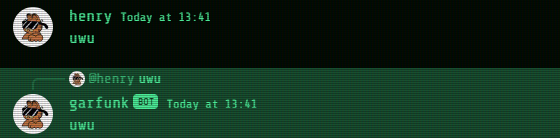
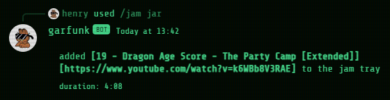
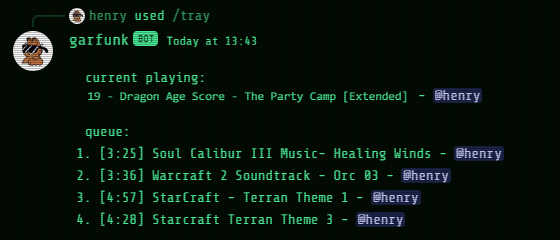

# Discord Jukebox

## About

Discord Jukebox is a Discord bot designed to provide seamless music playback and basic chat functionalities within Discord servers. Leveraging the YouTube API, Discord Jukebox offers a reliable solution for streaming music directly to your Discord server. The program is written in Javascript, powered by [Node.js](https://nodejs.org/en), and extensively utilises the [discord.js](https://discord.js.org/) library for its framework. Additionally, it leverages the [Discord Player](https://discord-player.js.org/) library to provide advanced music player functionalities.

### Features

- **Music Playback**: Utilises the YouTube API to stream music directly to Discord voice channels.
- **Chat Functionalities**: Provides basic chat features that can easily be expanded upon to enhance communication within Discord communities.
- **Slash Commands**: Employs slash commands for ease of use, allowing users to interact with the bot seamlessly and intuitively.
- **Customisable Commands**: Offers a flexible command architecture, allowing for easy addition and customisation of commands. Whether enhancing music playback controls or adding new chat features, Discord Jukebox provides a versatile platform for expanding functionality to meet the specific needs of your Discord community.
- **Efficient Performance**:
  - **Stable Playback**: Discord Jukebox prioritises stable music playback, even under challenging network conditions, aiming to provide uninterrupted music streaming for users.

## Getting Started

This guide outlines the steps to host this very Discord Jukebox on your very own computer, specifically for Windows. For other platforms, please refer to additional resources.

1. **Create and Set Up Your Discord Bot**:
  - Follow Discord's official [Getting Started](https://discord.com/developers/docs/getting-started) guide to create and set up your Discord bot.
2. **Install FFmpeg**:
  - Download [FFmpeg](https://ffmpeg.org/download.html) and install it.
  - Add the FFmpeg executable's path to your user environment variables.
3. **Install Node.js**:
  - This program is powered by [Node.js](https://nodejs.org/en).
  - Install Node.js version 16.20.2, as later versions have been known to return various dependency errors.
4. **Install Dependencies**:
  - Open your terminal and execute the following command to install dependencies:
    ```
    npm i dotenv discord.js @discordjs/opus discord-player @discord-player/extractor ytdl-core
    ```
  - `ytdl-core` was chosen as the YouTube streaming library for its ability to accept additional parameters for uninterrupted and better quality audio.
5. **Set Up Environment Variables**:
  - Create a `.env` file in your project directory.
  - Add your Discord bot `TOKEN` and `CLIENTID` details to the `.env` file:
    ```
    TOKEN=<token>
    CLIENTID=<clientid>
    ```
6. **Bring Your Discord Bot to Life:**
  - Run the bot by executing `node .` in your terminal.
  - Once running, your bot will be ready to respond to commands in your Discord server.

## Music Player Commands

| Command                    | Description                      |
| -------------------------- | -------------------------------- |
| `/jam` `jar` `<url>`       | play song                        |
| `/jam` `jug` `<url>`       | play playlist                    |
| `/jam` `crate` `<keyword>` | play first result from search    |
| `/freeze`                  | pause                            |
| `/defrost`                 | resume                           |
| `/jump`                    | skip                             |
| `/souffle`                 | shuffle                          |
| `/soberup`                 | order                            |
| `/tray`                    | show currently playing and queue |

## Examples






